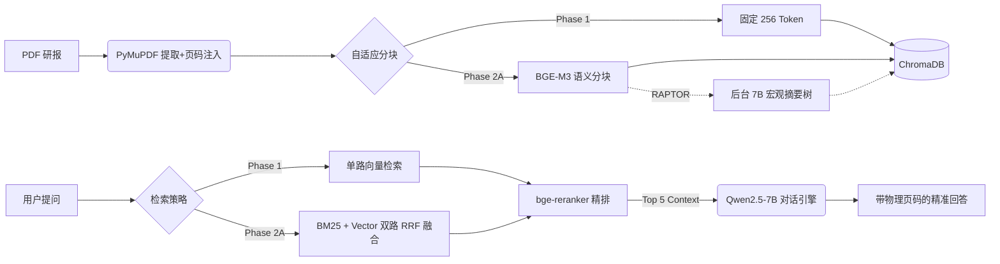

# Insight: 垂直领域金融研报分析引擎 (Financial Report Analysis Engine)


> **Insight** 旨在构建一个对标 Google NotebookLM 体验的金融研报 RAG 工作台。该系统完全离线部署于 Apple Mac Studio (M3 Ultra) 架构，利用 512GB 统一内存无缝支撑 `Qwen2.5-72B` 与高级检索管线的端到端运行，实现**零核心大模型 API 推理成本**与极致的数据隐私安全。

---

## ✨ 核心特性 (Key Features)

- 🔒 **100% 本地化 (Local-First)**：推理（7B/72B）、向量化 (BGE-M3)、精排 (BGE-Reranker) 均基于 MPS 硬件加速在本地完成。
- ✂️ **自适应语义分块 (Semantic Chunking)**：抛弃生硬的字数截断，依据句间余弦相似度（95% 阈值）进行自适应切分，保持财务逻辑连贯。
- 🌲 **宏观树状摘要 (RAPTOR)**：集成 `RaptorPack`，后台调用 7B 模型递归构建知识树，完美解答跨研报的宏观总结类提问。
- 🤝 **倒数秩融合混合检索 (Hybrid Search)**：在内存中重构 BM25 词频矩阵，与 ChromaDB 稠密向量双路召回后执行 RRF 融合，大幅降低数字型实体的漏召回率。
- 🎯 **交叉编码器精排 (Cross-Encoder Reranking)**：对粗筛结果进行地狱级重排截断，仅向生成端提交 Top-5 高纯度片段。
- 📊 **本地量化评估闭环 (LLM-as-a-Judge)**：内嵌 RAGAS 自动化评估脚本，使用本地 `Qwen2.5-72B` 充当无情裁判，产出客观的消融实验对比报告。

---

## 🗺️ 简化版技术路线图 (Architecture Pipeline)

本项目构建了一条严密且可自适应切换配置 (Phase 1 vs Phase 2A) 的 RAG 数据流：



---

## 📂 文档与指南地图 (Documentation Map)

本项目的核心资产在于其极其严谨的文档定义与工程规范。**在进行任何开发前，请务必阅读以下文档：**

- 🤖 **[AI 与开发者上下文总览](docs/00_README_AI_CONTEXT.md)**：开发本项目的 5 条铁律（必读）。
- 🏗️ **[架构设计与执行计划](docs/00_course_execution_plan.md)**：包含完整的 Mermaid 数据流转架构图与实施蓝图。
- 📄 **[API 契约与数据流转](docs/01_architecture_data_flow.md)**：定义了严格的 `source` 与 `page_label` 溯源元数据契约。
- ⚖️ **[评估与消融实验指标](docs/02_evaluation_metrics.md)**：定义了 20 题标准化测试集与内存-性能权衡分析方法论。
- 📝 **[技术债与重构日志](docs/04_technical_debt_log.md)**：记录了当前系统的性能瓶颈与未来重构计划（如 ChromaDB 耦合）。

---

## 🚀 快速启动与中期实验复现 (Quick Start)

本项目采用严格的**配置驱动 (Config-Driven)** 模式。通过修改 `configs/config.yaml` 即可无缝切换系统形态。

### 1. 环境准备
```bash
# 激活虚拟环境并安装 LlamaIndex 现代模块化依赖
source .venv/bin/activate
pip install -r requirements.txt

# 确保本地 Ollama 服务已启动，并拥有以下模型：
ollama pull qwen2.5:72b
ollama pull qwen2.5:7b
```

### 2. 实验复现与跑分
如需复现《项目进展报告》中的 **Phase 1 (基础 256 分块)** 与 **Phase 2A (语义分块+RAPTOR+混合检索)** 的性能差异，请直接参考专属的消融实验说明书：
👉 **[中期项目进展报告：消融实验与评估操作规范](docs/05_progress_report_guide.md)**

---

## 📁 目录结构 (Repository Structure)

```text
CS6496-group/
├── configs/
│   └── config.yaml           # 全局中枢配置（控制单路/多路、基线/语义策略）
├── data/                     # 存放 PDF 研报语料、20题测试集与输出的评测 CSV
├── docs/                     # 系统核心设计文档与架构蓝图
├── src/
│   ├── ingest/               # 数据接入层 (PDF 解析、分块器、ChromaDB 入库)
│   ├── retrieval/            # 检索层 (BM25+Vector 混合召回、RRF 融合、精排)
│   ├── generation/           # 生成层 (大模型对话代理、Prompt 防幻觉引擎)
│   ├── evaluation/           # 评估层 (RAGAS 本地 72B 裁判脚本)
│   └── utils/                # 基础工具 (全局配置解析)
└── requirements.txt
```

---
*Built for extreme performance on Apple Silicon Unified Memory Architecture.*